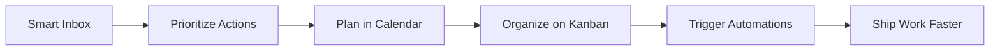

# Ordo

A modern productivity operating system for focused teams and ambitious individuals.

  

Ordo eliminates context switching by unifying your inbox, calendar, projects, and automation workflows into a single intelligent workspace. Built for clarity, speed, and deep focus, it brings together smart Gmail workflows, Google Calendar time-blocking, a Jira-style Kanban board, and real-time automations through Telegram and WhatsApp webhooks.

## Why Ordo?

- ⚡ Unified productivity workspace for communication, planning, and execution
- 🧠 Intelligent inbox workflows that reduce noise and prioritize action
- 📅 Drag-and-drop calendar planning with structured time blocking
- 🗂️ Visual project management with a polished Kanban experience
- 🤖 Real-time automation to connect tasks, messages, and operational updates
- 🎯 Designed for focus, clarity, and a calmer digital workflow

## Core Experience



## Feature Highlights

### 1. Smart Inbox
Bring your email into a structured command center where important messages become actionable work items.

### 2. Calendar Time Blocking
Turn your calendar into a planning interface with intuitive drag-and-drop scheduling and focused work sessions.

### 3. Project Board
Manage tasks visually with a modern Kanban board inspired by agile teams and product workflows.

### 4. Automation Layer
Connect Telegram and WhatsApp webhooks to create real-time updates, alerts, and workflow triggers.

## Tech Stack

- Next.js 16
- React 19
- Tailwind CSS
- TypeScript-ready architecture
- Clean component-driven UI structure

## Getting Started

### Prerequisites

- Node.js 20+
- npm 10+

### Installation

```bash
git clone https://github.com/your-username/ordo.git
cd ordo
npm install
npm run dev
```

Open http://localhost:3000 to view the app locally.

## Project Vision

Ordo is more than a dashboard. It is an operating layer for modern work that reduces fragmentation and helps users move from intent to execution without losing momentum.

## Roadmap

- Intelligent inbox prioritization
- Calendar drag-and-drop planning
- Kanban board enhancements
- OAuth and data integration layer
- Automation engine expansion
- Advanced analytics and productivity insights

## Contributing

Contributions are welcome. Please review the contributing guide before submitting changes.

## License

This project is licensed under the MIT License.
